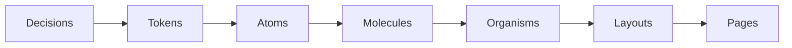

[https://www.youtube.com/watch?v=JyCmacSyDY4&ab_channel=Figma](https://www.youtube.com/watch?v=JyCmacSyDY4&ab_channel=Figma)

> [!info] Design Token: Définition
> Un design token est une décision graphique, qui s'apparente aux ==variables== en code. Un token est nommé puis est attribué une décision spécifique de design: *couleur, typesetting, espacement, etc.* L'usage de design tokens reflète une méthodologie de design qui s'inscrit dans la conception de *systèmes de design* (design systems).

> [!info] Variable: Définition
> Une variable s'illustre avec la métaphore d’une boite qui a un nom précis, dans laquelle on a un objet spécifique stocké dedans. En programmation, il s’agit d’un espace mémoire attitré, auquel on attribue une valeur. On parle alors généralement d’un ==identifiant== et de sa ==valeur==. C'est exactement la même chose en design sur Figma. Par exemple, sur Figma on pourrait créer une variable *primitive* `red-500` avec la valeur couleur `#ff0000`, ou encore une variable *sémantique* `font-body` avec la valeur texte `Helvetica Neue`, que l'on peut ensuite appliquer à travers nos designs.

Les tokens, en design comme en programmation, sont les blocs de constructions décortiquant chaque traitement graphique, que cela soit quant aux couleurs, espacements, tailles de textes, etc. C'est la toute première base permettant la construction cohérente de composants d'interfaces, et de design systems. Cette étape s'inscrit en tout premier lieu de la méthodologie de design atomique:



Si l'on compare avec des logiciels de mise en page imprimée comme InDesign, c'est à la fois ce qui s'apparente à vos styles de paragraphes, de caractères, d'objets, et votre nuancier. Pour mettre en place vos premiers tokens, il n'y a pas une seule bonne manière de faire, mais il y a quelques bonnes pratiques expliquées ci-dessous.

---

# Extraire des tokens d'un design

Si l’on imagine un composant d’interface primitif comme un bouton, on peut le décomposer en de nombreuses décisions ou tokens:

](/files/button-tokens.png)

La couleur primaire d’une application peut être nommée “app-base-primary” avec une valeur donnée ex: “#624de3”

Sous forme de donnée structurée (json par exemple ci-dessous) cela prendrait la forme suivante:

```css
{ 
  "name": "app-base-violet", 
  "value": "#624de3", 
  "type": "color" 
}
```

Ces informations peuvent ensuite être utilisées et formatées pour n’importe quel besoin et type de plateforme: Android, iOS, Web, etc.

---

# Avantages des tokens

- Source unique de vérité
- Meilleur workflow de design à developpement
- Consistence à travers différents canaux et interfaces
- Meilleure gestion du design system
- Meilleure gestion de thèmes (dark/light mode, etc.)
- Méthodologie claire pour collaboration inter-équipe

---

# Nommer des tokens

Les premiers tokens que l’on crée sont généralement associés aux couleurs, styles de textes, espacements et grilles. Selon la complexité d’un projet, il existe différentes catégories de tokens ayant un certain degré de spécificité.

](/files/tokens-pyramid-oscar-gonzales.png)

1. Valeur brute (pas de token – à éviter)
    
    Partir d’une valeur brute – Ex: une couleur en hexcode 
    
2. ==Primitive/Core== Tokens
    
    Nommés selon leur valeur/apparence. Ils ne sont pas nommés selon le contexte d'utilisation.
    Ex: La valeur brute `#5843f5`, devient un token `red-100`
    
3. ==Semantic== Tokens
    
    Considérés comme *alias* des core tokens,  nommés selon leur type et utilisation. Ils véhiculent plutôt l’intention que la valeur.
    Ex: `red-100` core token, peut être *aliased* en semantic token `color-danger`
    
    
4. ==Component== Tokens (optionnels)
    
    *Alias* des semantic tokens, la portée d'utilisation est délimitée pour des composants spécifiques.
    
    Ex: `color-danger` peut être aliased en tant que `button-danger-background-color`
    

> [!tip] Naming Best practice
> Nommer en kebab case selon l'ordre suivant:
>
> `category`-`property`-`surface`-`variant`-`state`
> Exemple: `color-background-container-primary--hover`

---

# Références


[Material Design: Design Tokens Overview](https://m3.material.io/foundations/design-tokens/overview)
[Specify App: Introduction to Design Tokens](https://specifyapp.com/blog/introduction-to-design-tokens)
[Damato.design: Tokens as intents](https://blog.damato.design/posts/tokens-as-intents/)
[Specify App: Crafting consistency: a thoughtful approach for naming design tokens](https://specifyapp.com/blog/crafting-consistency-a-thoughtful-approach-for-naming-design-tokens)
[UXdesign.cc: Design tokens for dummies](https://uxdesign.cc/design-tokens-for-dummies-8acebf010d71)
[UXdesign.cc: Design tokens cheatsheet](https://uxdesign.cc/design-tokens-cheatsheet-927fc1404099)
